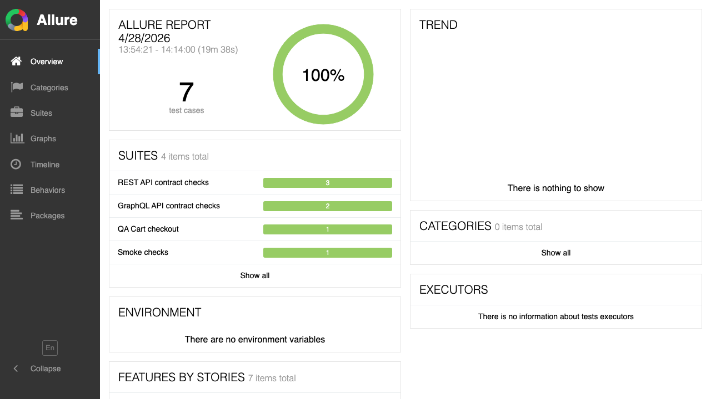

# project-cypress-e2e

Private Cypress E2E automation framework built around page objects, JSON selectors, JSON test data, and reusable assertions.

## What is included

- Cypress TypeScript test runner configuration
- Local demo app under `test-app`
- Local REST/GraphQL API service under `test-api`
- Page object model under `cypress/pages`
- JSON selectors under `cypress/selectors`
- JSON fixtures and flow data under `cypress/fixtures` and `cypress/test-data`
- API contract tests under `cypress/e2e/api`
- Postman collection and local environment under `postman`
- Custom command for reusable login behavior
- Video, screenshots, retries, Allure reporting, and type-check script

## Commands

```bash
npm install
npm run start:web
npm run start:api
npm run start
npm test
npm run test:smoke
npm run test:api
npm run cy:run
npm run cy:run:api
npm run cy:open
npm run clean:artifacts
npm run allure:generate
npm run allure:open
npm run lint:types
```

The automated smoke flow signs in, filters products, adds an item to the cart, checks subtotal, submits checkout, and validates the receipt.

## Report Evidence

The screenshot below shows the Allure overview generated from the current local run, including UI, API, and smoke coverage.



## API Testing

The local API exposes REST endpoints for health, login, products, and orders, plus a GraphQL endpoint for product queries and order mutations. The API suites validate status codes, headers, correlation IDs, authentication, response shapes, domain totals, authorization failures, inventory conflicts, and GraphQL error payloads.

Postman examples are available in `postman/qa-cart-api.postman_collection.json` with a matching local environment in `postman/qa-cart-api.postman_environment.json`.

## Local Troubleshooting

Cypress artifact cleanup is disabled in `cypress.config.ts` because some macOS setups can throw `spawn Unknown system error -86` while Cypress tries to trash old run results. Use `npm run clean:artifacts` when you want to remove videos, screenshots, and Allure output before a fresh run.

The `term-size: Bad CPU type in executable` warning can appear from a Cypress-bundled helper on Apple Silicon. It is noisy but non-blocking when the spec summary still reports passing tests.

Allure is configured to attach videos for passing and failing runs. Smoke tests also call `cy.captureEvidence(...)` so the report includes a screenshot even when the test passes.

## CI/CD

`Jenkinsfile` provides a declarative pipeline template that checks out the repo, runs `npm ci`, type-checks the framework, executes UI and API tests against local services, archives screenshots/videos, and publishes Allure results from `allure-results`.

Jenkins should have NodeJS configured as `node-20`, the Allure Jenkins plugin installed, and Java available on the agent for report generation.
